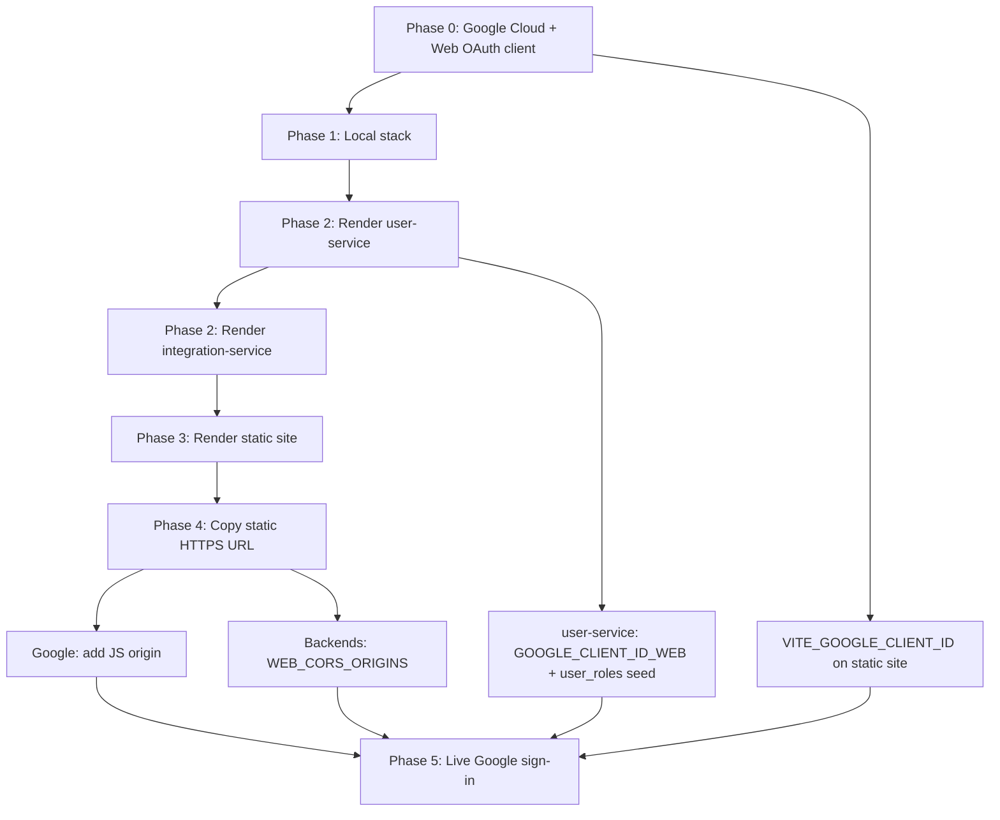

# End-to-end deployment sequence

Sequential checklist for configuring SharingBridge from **Google OAuth** through **local dev** to **Render** (backends + static web). Use this doc for **order of operations**; use linked docs for command-level detail.

| Phase | Goal | Detail doc |
|-------|------|------------|
| 0 | Google Web client + Client ID | [google-auth-setup.md](./google-auth-setup.md) Part 1–2 |
| 1 | Local web + backends (Google sign-in) | [google-auth-setup.md](./google-auth-setup.md) Part 3–6, [web-client.md](./web-client.md) |
| 2 | Render backends (user + integration) | [backend-render.md](./backend-render.md) |
| 2b | Postgres + `DATABASE_URL` (when using DB) | [database.md](./database.md) |
| 3 | Render static site (first deploy) | [web-client.md](./web-client.md) Deploy |
| 4 | Google origin + CORS for live URL | [google-auth-setup.md](./google-auth-setup.md) Part 7 |
| 5 | Verify hosted coordinator dashboard | [MANUAL_TESTING_GUIDE.md](../testing/MANUAL_TESTING_GUIDE.md) §4 |

Architecture: [authentication.md](./authentication.md). Persistence: [database.md](./database.md). Mobile (donor): [mobile-client.md](./mobile-client.md).

---

## Dependency overview



---

## What blocks what

| Task | Blocked until you have… |
|------|-------------------------|
| Create Web OAuth client + Client ID | Google Cloud project only |
| Local Google sign-in (web) | Client ID, `WEB_CORS_ORIGINS` on both Node services, `coordinator` in `user_roles` |
| Deploy Render static site | Repo on Render; hosted API URLs recommended |
| Add Render URL to Google **Authorized JavaScript origins** | **Static site URL** from first deploy |
| Hosted Google sign-in works | `VITE_GOOGLE_CLIENT_ID` on static site **and** Google origin **and** `WEB_CORS_ORIGINS` on both backends **and** `coordinator` in Postgres `user_roles` |
| Donor intents visible on hosted dashboard | Mobile (or API) uses the **same** integration host as `VITE_API_BASE_URL` |

**Common misconception:** you need the Render static URL before creating the Google client — **no**. Create the Web client early with `http://localhost:5173`; add the Render origin after the first static deploy.

**Another:** you cannot create the static site until you have the Client ID — **partially true**. You can deploy the site without `VITE_GOOGLE_CLIENT_ID`, but **Sign in with Google** on the live URL requires the ID plus Phase 4 (origins + CORS).

---

## Phase 0 — Google Cloud (do first)

**Depends on:** nothing in SharingBridge.

**No Google Workspace organization?** That is normal. A personal Gmail account with a project named `sharingbridge` (no org) is enough for MVP dev.

**Order matters:** configure the **OAuth consent screen** before **Credentials → OAuth client ID**. Google will block client creation until the consent screen exists.

### 0.1 Create the project (you may have finished this)

1. Open [Google Cloud Console](https://console.cloud.google.com/).
2. Top bar → project picker → **New Project** → name e.g. `sharingbridge` → **Create**.
3. Wait ~30 seconds, then open the project picker again and **select** `sharingbridge` so the top bar shows that project name.

**You are here if:** the top bar says `sharingbridge` (not “No project selected”).

### 0.2 Open APIs & Services

From the **home dashboard** of project `sharingbridge`:

1. Left **☰** menu (top-left) → **APIs & Services**.
2. You should land on **Enabled APIs & services** or see a submenu:
   - **OAuth consent screen** ← do this next (0.3)
   - **Credentials** ← after consent screen (0.4)

Direct links (must have `sharingbridge` selected in the top bar):

- Consent screen: [OAuth consent screen](https://console.cloud.google.com/apis/credentials/consent)
- Credentials: [Credentials](https://console.cloud.google.com/apis/credentials)

### 0.3 OAuth consent screen (required before client ID)

Google’s UI has two layouts. Use **A** or **B** depending on what you see.

#### Layout A — New hub: **OAuth overview** (most common in 2025–2026)

1. Go to **APIs & Services** → **OAuth consent screen** (or [OAuth overview](https://console.cloud.google.com/auth/overview)).
2. First-time setup: choose **External** → **Create** (only option for personal Gmail is normal).
3. Fill **App information** (app name, support email, developer contact) → **Save**.
4. You land on **OAuth overview** — this is correct; you are not stuck.

From **OAuth overview**, use the **left sidebar** (or section cards on the page):

| What you need | Where to click | What to do for SharingBridge MVP |
|---------------|----------------|----------------------------------|
| **Scopes** | **Data Access** ([direct link](https://console.cloud.google.com/auth/scopes)) | Usually **nothing required**. Sign in with Google requests `openid`, `email`, `profile` at login time. If the scopes table is empty, that is OK — skip to Test users. Only use **ADD OR REMOVE SCOPES** if Google later blocks sign-in for missing scopes. |
| **Test users** | **Audience** ([direct link](https://console.cloud.google.com/auth/audience)) | Under **Test users** → **+ Add users** → add every Gmail you will sign in with (coordinator + donor). Required while **Publishing status** is **Testing**. |
| App name / emails again | **Branding** ([direct link](https://console.cloud.google.com/auth/branding)) | Edit only if you need to change app info. |

**Do not look for “Save and Continue” on the overview page** — that was the old wizard. Use the sidebar links above.

**Checkpoint:** Overview shows **Publishing status: Testing**; **Audience** lists your test Gmail(s).

#### Layout B — Old wizard (multi-page **Save and Continue**)

If Google still shows numbered steps instead of the overview hub:

1. **App information** → **Save and Continue**
2. **Scopes** → **Save and Continue** (defaults OK; no need to add scopes manually for MVP)
3. **Test users** → add Gmail addresses → **Save and Continue**
4. **Summary** → **Back to Dashboard**

#### Scopes — do you need to add any?

For **Sign in with Google** (web GIS + mobile), you typically **do not** pre-register scopes on **Data Access**. The library requests basic identity scopes when the user signs in.

If you open **Data Access** and the table is empty, you can proceed to **Audience** (test users) and then **Credentials** (0.4).

Detail: [google-auth-setup.md](./google-auth-setup.md) Part 1.3 · [Manage app data access (scopes)](https://support.google.com/cloud/answer/15549135) · [Manage app audience (test users)](https://support.google.com/cloud/answer/15549945).

### 0.4 Create Web OAuth client ID

1. Go to **APIs & Services** → **Credentials** (link above).
2. Top of page → **+ Create credentials** → **OAuth client ID**.
   - If this menu item is disabled, finish **0.3** (consent screen) first.
3. **Application type:** **Web application**.
4. **Name:** e.g. `SharingBridge Web (local)`.
5. **Authorized JavaScript origins** → **+ Add URI**:
   ```text
   http://localhost:5173
   ```
   - Use `http` (not `https`) for local Vite.
   - No trailing slash, no path (not `/login`).
6. **Authorized redirect URIs** — leave empty for MVP GIS button flow, or add the same origin if Google prompts you:
   ```text
   http://localhost:5173
   ```
7. **Create** → dialog shows **Client ID** and Client secret.
8. Copy only the **Client ID** (ends with `.apps.googleusercontent.com`).  
   Save it as:
   - `VITE_GOOGLE_CLIENT_ID` (web-app `.env`)
   - `GOOGLE_CLIENT_ID_WEB` (user-service `.env`)  
   You do not need the client secret in SharingBridge for this flow.

**Add Render URL later** (Phase 4): edit this same Web client → add `https://<your-static-site>.onrender.com` under JavaScript origins.

Detail: [google-auth-setup.md](./google-auth-setup.md) Part 2.1.

### 0.5 Optional now — Android client (mobile donor)

Skip until Phase 1 mobile testing: **Credentials** → **+ Create credentials** → **OAuth client ID** → **Android** (package name + SHA-1). See [google-auth-setup.md](./google-auth-setup.md) Part 2.2.

### Phase 0 summary

| Step | Where in Console | Done when |
|------|------------------|-----------|
| 0.1 | Project picker | Top bar shows `sharingbridge` |
| 0.2 | ☰ → APIs & Services | You see Consent + Credentials |
| 0.3 | OAuth consent screen | External + test users added |
| 0.4 | Credentials → OAuth client ID → Web | Client ID copied; `http://localhost:5173` in origins |

**Checkpoint:** you have a Web Client ID; localhost origin is listed; your Gmail is a **test user** on the consent screen.

---

## Phase 1 — Local stack

**Depends on:** Phase 0 Client ID.

### 1.1 user-service

```powershell
cd sharingbridge-user-service
copy .env.example .env
```

| Variable | Example (local) |
|----------|-------------------|
| `GOOGLE_CLIENT_ID_WEB` | Same Web Client ID from Phase 0 |
| `WEB_CORS_ORIGINS` | `http://localhost:5173` only (local laptop `.env`; not the Render URL) |
| `ALLOW_DEV_TOKEN_MINT` | `true` (local only) |
| `AUTH_TOKEN_SECRET` | Shared secret (match integration-service) |

Coordinator role: Postgres `user_roles` — [coordinator-seed.sql](./coordinator-seed.sql) · [google-auth-setup.md](./google-auth-setup.md) Part 3.

### 1.2 integration-service

```powershell
cd sharingbridge-integration-service
copy .env.example .env
```

| Variable | Example (local) |
|----------|-------------------|
| `AUTH_TOKEN_SECRET` | **Same** as user-service |
| `USER_SERVICE_BASE_URL` | `http://localhost:8081` |
| `WEB_CORS_ORIGINS` | `http://localhost:5173` (same value as user-service) |

### 1.3 web-app

```powershell
cd sharingbridge-web-app
copy .env.example .env
```

| Variable | Example (local) |
|----------|-------------------|
| `VITE_GOOGLE_CLIENT_ID` | Web Client ID from Phase 0 |
| `VITE_API_BASE_URL` | `http://localhost:8080` |
| `VITE_USER_SERVICE_BASE_URL` | `http://localhost:8081` |

Optional: `VITE_ALLOW_DEV_SIGN_IN=true` only with `ALLOW_DEV_TOKEN_MINT=true` on user-service.

### 1.4 Run and verify

1. Start user-service (`npm start`, port 8081).
2. Start integration-service (`npm start`, port 8080).
3. `npm run dev` in web-app → http://localhost:5173.
4. **Sign in with Google** using a Gmail with `coordinator` in `user_roles`.
5. **Refresh** after a donor registers an intent on mobile (local).

**Checkpoint:** coordinator dashboard works on localhost with Google sign-in.

---

## Phase 2 — Render backends

**Depends on:** Render account + GitHub repos. **Does not** require static site URL yet.

### Phase 2b — Database (required)

**Local:** [database.md](./database.md) Option A (Postgres on your machine).  
**Production:** Supabase — same `schema.sql` in SQL Editor.

1. Create database and run `configuration/schema.sql`.
2. **Local only:** run `configuration/local-postgres-grants.sql` as `postgres` if the app user is `sharingbridge`.
3. Set **`DATABASE_URL`** in both services’ `.env` (local) or Render env (hosted).
4. Optional one-time: `npm run import:json` / `npm run import:order-intents` per [database.md](./database.md).

**Supabase (Render):** create project → SQL Editor → `schema.sql` → copy database URI → `DATABASE_URL` on both Node services → redeploy.

Deploy in order — [backend-render.md](./backend-render.md):

1. **user-service** (Web Service, Node 20).
2. **ai-orchestration** (Docker) — if integration uses AI paths.
3. **integration-service** (Web Service, Node 20).

### user-service (Render environment)

| Variable | Production value |
|----------|------------------|
| `AUTH_TOKEN_SECRET` | Strong secret; **same** on integration-service |
| `GOOGLE_CLIENT_ID_WEB` | Web Client ID from Phase 0 |
| `GOOGLE_CLIENT_ID_ANDROID` | Android Client ID (when mobile uses Google) |
| `ALLOW_DEV_TOKEN_MINT` | `false` |
| `DATABASE_URL` | **Supabase** Postgres URI (DB mode) — [database.md](./database.md) |
| `WEB_CORS_ORIGINS` | Optional until Phase 4: `http://localhost:5173` if you test local Vite against hosted APIs; otherwise set in Phase 4 |

### integration-service (Render environment)

| Variable | Production value |
|----------|------------------|
| `AUTH_TOKEN_SECRET` | Match user-service |
| `DATABASE_URL` | **Same** as user-service — [database.md](./database.md) |
| `USER_SERVICE_BASE_URL` | `https://<your-user-service>.onrender.com` |
| `WEB_CORS_ORIGINS` | **Identical** to user-service on Render (see Phase 4) |

Note the two public URLs:

- `https://<your-user-service>.onrender.com`
- `https://<your-integration-service>.onrender.com`

**Checkpoint:** `GET …/health` succeeds on both hosted services.

---

## Phase 3 — Render static site (first deploy)

**Depends on:** Phase 2 URLs if the dashboard should call **hosted** APIs (recommended).

1. [Render Dashboard](https://dashboard.render.com/) → **New +** → **Static Site**.
2. Repo: `sharingbridge-web-app`, branch `main`.
3. **Build command:** `npm install && npm run build`
4. **Publish directory:** `dist` (Vite output folder — not source `src/`)
5. **Environment** (build-time — set before first deploy):

| Key | Value |
|-----|--------|
| `VITE_API_BASE_URL` | `https://<your-integration-service>.onrender.com` |
| `VITE_USER_SERVICE_BASE_URL` | `https://<your-user-service>.onrender.com` |
| `VITE_GOOGLE_CLIENT_ID` | Web Client ID from Phase 0 |

Do **not** set `VITE_ALLOW_DEV_SIGN_IN` on Render.

6. Deploy → copy static site URL, e.g. `https://sharingbridge-web.onrender.com`.

**Checkpoint:** site loads in browser; Google button may appear but sign-in may fail until Phase 4.

---

## Phase 4 — Wire live URL (Google + CORS)

**Depends on:** Phase 3 static site URL (exact `https://….onrender.com`).

### 4.0 Backend CORS on Render (user-service **and** integration-service)

In the **Render dashboard** (not your laptop `.env`), set the **same** `WEB_CORS_ORIGINS` on **both** Node services:

```env
WEB_CORS_ORIGINS=https://<your-static-site>.onrender.com
```

If you still open the dashboard at http://localhost:5173 while calling **hosted** APIs:

```env
WEB_CORS_ORIGINS=http://localhost:5173,https://<your-static-site>.onrender.com
```

Redeploy **user-service** and **integration-service** after saving. Local `.env` files are **not** read on Render.

See [backend-render.md](./backend-render.md) § `WEB_CORS_ORIGINS`.

### 4.1 Google Console

[Credentials](https://console.cloud.google.com/apis/credentials) → your **Web application** client → **Edit**.

**Authorized JavaScript origins** — add **both** (no trailing slash):

```text
http://localhost:5173
https://<your-static-site>.onrender.com
```

Same Web Client ID for local and Render.

### 4.2 Static site rebuild (only if `VITE_*` changed)

If you added or changed `VITE_*` after first deploy, trigger a **manual deploy** on the static site so Vite rebakes env into `dist/`.

**Checkpoint:** browser can call Google GIS and both APIs from the live origin; CORS on Render includes `https://<your-static-site>.onrender.com` on **both** backends (§4.0).

---

## Phase 5 — Verify production web

**Depends on:** Phases 0–4.

1. Open `https://<your-static-site>.onrender.com`.
2. **Sign in with Google** with a Gmail that has `coordinator` in `user_roles` (Supabase/Postgres seed).
3. **Refresh** — order initiations appear when donors used the **same** integration host (`VITE_API_BASE_URL` = mobile `API_BASE_URL`).

Manual test steps: [MANUAL_TESTING_GUIDE.md](../testing/MANUAL_TESTING_GUIDE.md) **§4**.

---

## One-page checklist

- [ ] **0** Google Web OAuth client; `http://localhost:5173` in JS origins; Client ID saved
- [ ] **1** Local `.env` on user-service, integration-service, web-app; local Google sign-in works
- [ ] **2** Render user-service + integration-service; shared `AUTH_TOKEN_SECRET`; `ALLOW_DEV_TOKEN_MINT=false`; coordinators on Render
- [ ] **3** Render static site; `VITE_*` point at hosted APIs + `VITE_GOOGLE_CLIENT_ID`; copy static URL
- [ ] **4** Add static URL to Google JS origins; `WEB_CORS_ORIGINS` on both backends; redeploy backends
- [ ] **5** Live coordinator sign-in; dashboard refresh shows intents from hosted integration API

---

## Mobile (donor) — after Phase 2

Hosted mobile uses the same integration URL as the web dashboard:

```text
USER_SERVICE_BASE_URL=https://<your-user-service>.onrender.com
API_BASE_URL=https://<your-integration-service>.onrender.com
GOOGLE_CLIENT_ID=<Android client id>
```

See [mobile-client.md](./mobile-client.md).

---

## Troubleshooting by phase

| Symptom | Likely phase | Fix |
|---------|--------------|-----|
| Google popup / `origin_mismatch` | 4 | Add exact static URL to **Authorized JavaScript origins** |
| CORS error in browser console | 4 | `WEB_CORS_ORIGINS` on **both** backends includes static URL |
| Sign-in works locally, not on Render | 3–4 | `VITE_GOOGLE_CLIENT_ID` set; rebuild static site; origins + CORS |
| `403 wrong_client_role` on web | 1 / 2 | Grant `coordinator` in `user_roles` ([coordinator-seed.sql](./coordinator-seed.sql)); web client only for coordinators |
| Empty dashboard on Render | 5 | Donor mobile must post to **same** `VITE_API_BASE_URL` host |
| `401` / invalid token | 2 | `AUTH_TOKEN_SECRET` must match on user-service and integration-service |

More: [google-auth-setup.md](./google-auth-setup.md) troubleshooting section.
