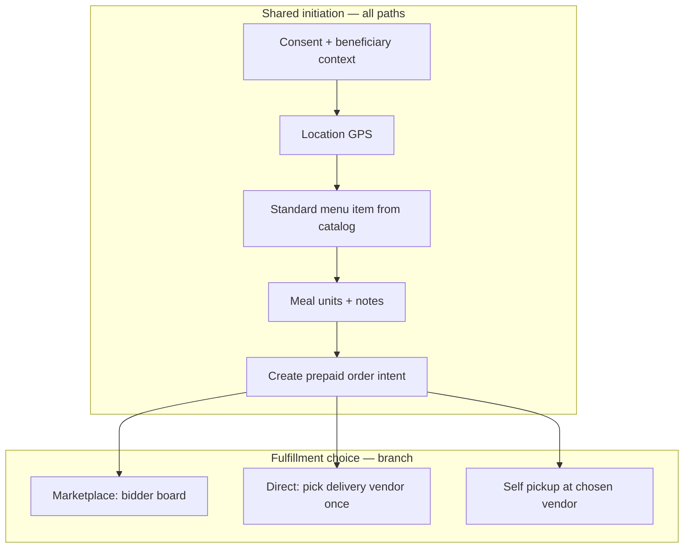
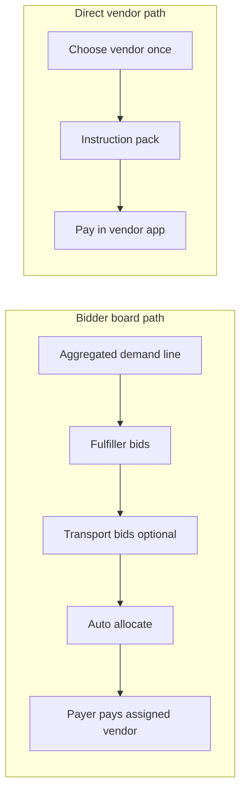

# Configurator role, terminology, and unified meal initiation

**Purpose:** Product principles so SharingBridge does **not** become a manually operated coordinator desk. Defines the **configurator** (renamed from coordinator for geographic setup), a responsibility map for later owners, and the planned **merge** of “Help a seeker” and “Record seeker demand” into one **prepaid order intent** flow with optional marketplace fulfillment.

**Status:** Design / roadmap — not fully implemented in code. Current MVP still uses JWT role `coordinator`, separate mobile entry points, and `seeker_demands` vs `order_intents` tables.

> **Initiation routes (authoritative):** [Eco_Kitchen_Initiation_Flow.md](./Eco_Kitchen_Initiation_Flow.md) defines **Direct order**, **Eco kitchen · I pay**, and **Eco kitchen · open for pledging**, plus connection and payment boundaries. Sections 5–6 below describe an older unified-flow sketch; prefer the Eco Kitchen doc for route naming and payment model.

**Doc map:** [README.md § Documentation guide](../README.md#documentation-guide)  
**Related:** [PRODUCT_MODEL.md](../development/PRODUCT_MODEL.md) (glossary, actors), [ENGINEERING_PLAN.md](../development/ENGINEERING_PLAN.md) (phases E–I), [database-setup-sequence.md](../configuration/database-setup-sequence.md) (marketplace SQL).

---

## 1. Core principle — no full-time local ops

| Do | Don't |
|----|--------|
| One-time (or rare) **geographic configuration** | Distributed volunteers acting as daily operators |
| **Self-service** for payers, initiators, vendors | Coordinator clicks on every pledge, bid, or payment |
| **Automation** for matching, timeouts, aggregation | Manual reconciliation as the default path |
| **Exception queues** for platform admin | Implied SLA on local volunteers |

**Configurator** = someone who sets up a geography once (menus, locality keys, optional zone boundary), then steps back. They are **not** employees and **not** on-call for runtime marketplace events.

---

## 2. Configurator vs coordinator (rename plan)

### Product language

| Old term | New term | Scope |
|----------|----------|--------|
| **Coordinator** (local) | **Configurator** | Geographic/menu setup; optional zone nomination |
| **Coordinator** (central disputes) | **Platform admin** | Overlap appeals, abuse, rare corrections |
| **Payer** (funding) | **Payer** | Anyone paying vendor directly (relative, neighbour, initiator on behalf of beneficiary). **Payee** = vendor/kitchen receiving funds. |

JWT/API role `coordinator` remains during migration. Target:

- `configurator` — can edit `standard_offers` and `locality_zones` for assigned keys only
- `admin` — global exceptions
- `initiator` — registers intents/demands (mobile JWT today)
- `payer` — future explicit role when payer ≠ initiator; **`primary_payer_user_id` / `backup_payer_user_id`** on allocation records

### Phased rename (avoid big-bang)

1. **Docs + UI copy** — “Configurator” on setup screens; “Demand board” stays read-mostly for transparency
2. **API aliases** — `role: configurator` accepted alongside `coordinator` for config endpoints
3. **Split permissions** — configurator cannot POST manual vendor bids (MVP debt removed when fulfiller self-service ships)
4. **Deprecate** `coordinator` role name in tokens once mobile/web updated

---

## 3. Responsibility map (who owns what at runtime)

Configurator appears only in **configuration** rows. Everything else needs a different owner or automation.

| Responsibility | Primary owner | Human touch |
|----------------|---------------|-------------|
| `locality_key` + hierarchical menus (`IN:TN:600045`, fallbacks `IN:TN`, `IN`) | **Configurator** (once) | Seed / approve catalog |
| Zone polygon, non-overlap | **Configurator** + admin publish check | One-time draw |
| Capture beneficiary need + location | **Demand initiator** (signed-in) | Field or remote |
| Aggregate demand | **System** | Never manual |
| Prep capacity | **Demand fulfiller** (vendor kitchen) | Self-service bid |
| Transport capacity | **Transport bidder** | Self-service bid |
| Fund meals | **Payer** (primary + backup) | Pay vendor app; mark paid |
| Match supply to demand | **Allocation engine** | Exceptions only |
| Payment / delivery proof | **Payer** + vendor / transporter | Status + optional photo |
| Unpaid primary → backup | **System** (timeout + notify) | Admin if both fail |
| Disputes, overlap appeals | **Platform admin** | Rare |

**Later analysis:** For each new feature, add one row here before building UI. If the only owner is “configurator,” redesign.

---

## 4. Hierarchical `locality_key` (configurator input)

Aggregation and standard menus resolve at:

```text
{ISO3166-1}:{ISO3166-2}:{postal}
```

Examples: `IN:TN:600045`, `US:CA:94103`.

**Standard offers** may be keyed at any depth; **most specific wins** at resolve time (`IN:TN:600045` → `IN:TN` → `IN`).

Configurator loads menus at the depth that matches their pilot (usually postal). State/country rows are optional defaults.

---

## 5. Unified meal initiation (merge Help a seeker + Record seeker demand)

### Problem today

Two mobile paths with overlapping intent:

| Path today | Table / API | User experience |
|------------|-------------|-----------------|
| **Help a seeker** | `order_intents` | Photo, instruction pack, copy, register handover |
| **Record seeker demand** | `seeker_demands` | Standard menu item, GPS, demand board only |

Both express “someone needs a meal here” but fork data and mental model.

### Target: one **meal initiation** flow

Single hub entry (working name: **Arrange a meal** or **Help a seeker** — TBD in UX copy).



### `prepaid order intent` (conceptual record)

Extends today’s **order intent** — still **not** platform escrow; “prepaid” means **payer commits to pay vendor** before or as part of initiation (primary + backup payer later).

| Field (conceptual) | Notes |
|--------------------|--------|
| `order_intent_id` | Stable id (merge seeker_demand id or link 1:1) |
| `initiator_user_id` | Demand initiator / field reporter |
| `locality_key` | `IN:TN:600045` |
| `standard_offer_id` | Catalog line |
| `meal_units` | Count |
| `fulfillment_mode` | `marketplace_bid` \| `direct_vendor` \| `self_pickup` |
| `payment_intent` | `prepaid_commitment` (payer will pay vendor) |
| `primary_payer_user_id` / `backup_payer_user_id` | Future allocation (legacy sketch: `primary_payee_user_id`) |
| Beneficiary context | Photo, notes, verbal (from Help a seeker today) |
| Instruction pack | Optional AI text when direct vendor path |

**Deprecation:** `seeker_demands` as a separate product concept → absorbed into order intent with `intent_kind: meal_arrangement` (or always implied). Demand board reads from the same store filtered by window + locality + offer.

### Why merge

- One history list for initiators and payers
- One aggregation pipeline for marketplace
- Same standard menu picker everywhere
- BRD “order intent” remains the handover signal; marketplace demand is not a second species

---

## 6. Fulfillment branch after initiation

Chosen **per initiation** (not configurator):

| Mode | When | Flow |
|------|------|------|
| **Marketplace / bidder board** | Bulk window, best price, community lunch | Intent joins demand window → fulfiller bids → transport bids if needed → allocation → notify payers |
| **Direct vendor (one-time)** | Initiator already knows the kitchen | Pick vendor from preset / search → instruction pack → pay in vendor app → track on same order intent |
| **Self pickup** | Beneficiary collects | Skip transport; vendor proof at pickup |

Direct vendor path reuses today’s **Help a seeker** tail (copy, deep link, `payment_status`). Marketplace path reuses **demand board** + bids without a human configurator in the loop.



---

## 7. Configurator touchpoints in unified model

| Action | Configurator? |
|--------|----------------|
| Load menus for `IN:TN:600045` | Yes — once |
| Record seeker demand in field | **No** — demand initiator |
| Enter vendor bid manually | **No** — temporary MVP only; remove |
| Choose marketplace vs direct vendor | **No** — initiator at initiation time |
| Assign primary/backup payer | **No** — system or initiator invite |

---

## 8. Implementation phases (suggested)

| Phase | Deliverable |
|-------|-------------|
| **Now** | Standard offers + demand board; document this model |
| **Next** | `locality_key` as `IN:TN:POSTAL`; hierarchical menu resolve |
| **Then** | Mobile: single **Arrange a meal** flow; standard item + optional instruction pack |
| **Then** | `order_intents` carry `standard_offer_id`, `fulfillment_mode`; retire separate `seeker_demands` POST for mobile |
| **Then** | Payer primary/backup on allocation; rename UI configurator |
| **Later** | Configurator self-service UI (menus/zones); fulfiller self-service bids |

---

## 9. Open questions (for later analysis)

- Exact UX label: **Arrange a meal** vs **Help a seeker** vs **Meal initiation**
- Whether **prepaid** requires payer confirmation up front or soft commitment until allocation
- Per-row vs per-bucket primary/backup payer
- Recurring plans (demand initiator month-long) — same intent type with `recurrence` metadata
- Migration of existing `seeker_demands` rows into order intents

---

## 10. Guardrail checklist (use in PRs)

- [ ] Does this require a configurator on every successful path?
- [ ] Is there a self-service actor (payer, fulfiller, initiator)?
- [ ] Is manual coordinator UI marked **MVP temporary** with named successor owner?
- [ ] Does copy say **configurator** / **payer** / **initiator** where appropriate?
