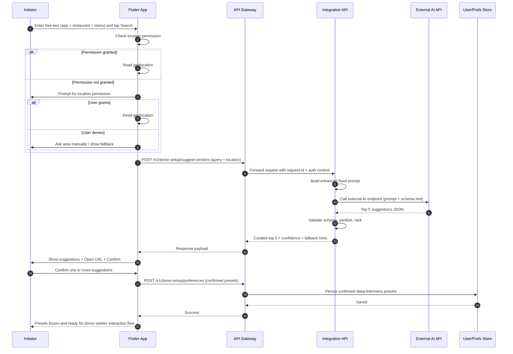

# Vendor preset setup — AI search sequence

> **API (legacy path):** `POST /v1/donor-setup/suggest-vendors` · **Product term:** vendor preset setup.

This sequence defines the MVP flow for AI-assisted vendor preset setup:

- User enters free-text (restaurant/app/menu hints)
- App requests location (or asks user if permission is missing)
- API enriches prompt and calls external AI
- Top 5 suggestions are returned as validated JSON
- User confirms one or more entries
- App saves confirmed presets as deep links/menu templates

