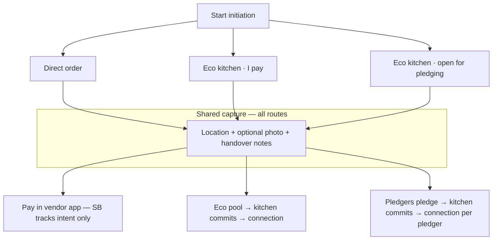
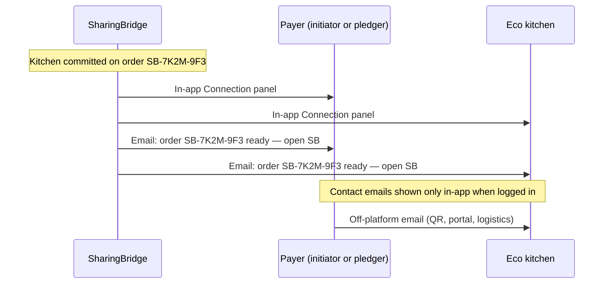

# Eco Kitchen initiation — routes, connection, and payment boundaries

**Purpose:** Authoritative product flow for **how initiations are started**, **how eco kitchens fulfil**, and **how payers connect without SharingBridge handling money or publishing phone numbers**.

**Status:** Design approved (June 2026). **Phase 1–2 shipped:** copy + consent UI. **Phase 3 shipped:** order codes, `initiation_route`, consent API. **Phase 4 shipped:** `GET /v1/connections/:orderCode`, web Connection panel, FCM webhook path (`CONNECTION_NOTIFY_WEBHOOK_URL`). **Phase 5 shipped:** mobile **Eco kitchen · I pay** route. **Phase 6 shipped:** unified eco kitchen labels, kitchen-commit copy on Actions, per-route initiation display.

**Doc map:** [README.md § Documentation guide](../README.md#documentation-guide)

| Also read | For |
|-----------|-----|
| [PRODUCT_ROADMAP.md](../development/PRODUCT_ROADMAP.md) | Glossary, actors, verbiage |
| [Configurator_Role_and_Unified_Initiation.md](./Configurator_Role_and_Unified_Initiation.md) | Configurator vs runtime ops (no daily coordinator desk) |
| [Future_Extensions.md](./Future_Extensions.md) | Direct-order payment-done + delivery proof (Phase A–B) |
| [field-handoff.md](../configuration/field-handoff.md) | Shipped **Direct order** capture (Help a seeker) |
| [PROGRESS.md](../development/PROGRESS.md) | What is live in code today |

**Supersedes (for initiation routes & eco payment):** older “vendor bidding marketplace” and “pledge route” wording in scattered docs. Internal API table `vendor_bids` remains during migration; product language is **kitchen commitment**, not auction.

---

## 1. Design principles

| Principle | Meaning |
|-----------|---------|
| **Facilitator, not merchant of record** | SB orchestrates intent, routing, and status — never holds funds. |
| **No in-app payments** | No card/UPI collection, wallet, or escrow in SharingBridge. |
| **No public phone book** | Login emails and payment artifacts are **not** listed publicly; connection is **scoped to an order**. |
| **In-app source of truth** | Order code + connection panel when logged in beats email content. |
| **Email = notification only** | Transactional mail says “open SB for order `SB-…`”; **no QR, UPI ID, or payment links in email**. |
| **Off-platform settlement** | Payer and eco kitchen agree payment channel (QR, portal, etc.) **after** SB introduces them. |

### Eco kitchens (definition)

**Eco kitchens** are crowd-sourced kitchens on the network that **commit** to:

- A **standard, limited menu** (economical at volume)
- **Nutritious, hygienic** preparation
- **Eco-friendly** packaging
- **Collaborative** fulfilment at neighbourhood scale

Product slug: `eco_kitchen`. User-facing label: **Eco kitchens** (route variants below).

---

## 2. Three initiation routes

| Route | User-facing label | Who pays | Fulfilment |
|-------|-------------------|----------|------------|
| **1** | **Direct order** | Initiator in vendor app (Swiggy, Zomato, …) | Chosen vendor — outside eco network |
| **2** | **Eco kitchen · I pay** | Initiator, **after** kitchen commits | Eco kitchen network |
| **3** | **Eco kitchen · open for pledging** | **Pledgers** (not necessarily initiator) | Eco kitchen network |

**Internal API targets (future):** `initiation.route` = `direct_order` | `eco_kitchen_self_pay` | `eco_kitchen_pledge`.

**Today:** Route 1 ≈ `order_intents`; Route 3 ≈ `seeker_demands` + dashboard pledges. Route 2 is **not** a separate type yet.

---

## 3. Order code

Every initiation (and each kitchen commitment) is keyed by an **order code** e.g. `SB-7K2M-9F3`.

| Property | Rule |
|----------|------|
| **Visibility** | Logged-in **initiator**, **assigned eco kitchen**, **relevant pledgers**, **coordinator/admin** only |
| **Use** | Parties confirm they discuss the **same** order before paying off-platform |
| **Not** | A payment link or checkout token |

---

## 4. Route 1 — Direct order (shipped, partial)

| Step | Actor | Action |
|------|--------|--------|
| 1 | Initiator | Chooses **Direct order** |
| 2 | Initiator | Shared capture: location, optional reference photo, handover notes |
| 3 | SB | Instruction pack + register `order_intent` → order code |
| 4 | Initiator | Copies instructions → orders and pays in **vendor app** |
| 5 | Initiator | Marks **paid externally** in SB (status only) |
| 6 | — | Delivery per vendor; optional coordinator **mark delivered** |

See [field-handoff.md](../configuration/field-handoff.md), [Future_Extensions.md](./Future_Extensions.md) Phase A.

**No** eco kitchen intro. **No** SB payment rail.

---

## 5. Route 2 — Eco kitchen · I pay (planned)

| Step | Actor | Action |
|------|--------|--------|
| 1 | Initiator | Chooses **Eco kitchen · I pay** |
| 2 | Initiator | Shared capture + standard menu item / units / area |
| 3 | SB | Records initiation → order code → **Open** |
| 4 | Eco kitchens | Review pool → **commit** (portions, price, ETA, menu line) |
| 5 | SB | Status **Kitchen committed**; initiator = **payer** |
| 6 | SB | **Connection ready** (§7) |
| 7 | Initiator ↔ kitchen | Off-platform email: follow-up, QR, payment portal |
| 8 | Initiator / kitchen | Optional status: payment reported / confirmed |
| 9 | Kitchen | Prepare → deliver → **Delivered** |

---

## 6. Route 3 — Eco kitchen · open for pledging (partial today)

| Step | Actor | Action |
|------|--------|--------|
| 1 | Initiator | Chooses **Eco kitchen · open for pledging** |
| 2 | Initiator | Shared capture + menu / units / area |
| 3 | SB | Records initiation → order code → **Open for pledging** |
| 4 | Pledgers | Pledge units on dashboard (**Actions** tab) — commitment, not money in SB |
| 5 | SB | When coverage rules met → **ready for kitchen** |
| 6 | Eco kitchen | **Commits** (price per unit, cap, ETA) |
| 7 | SB | **Connection ready** per pledger (+ kitchen); initiator sees status |
| 8 | Each pledger ↔ kitchen | Off-platform payment for their portion |
| 9 | — | Fulfilment → **Delivered** |

**Today:** Steps 1–4 ≈ mobile **For pledging** + `seeker_demands` + web **Actions** pledges. Steps 5–9 are design / partial.

---

## 7. Connection ready (routes 2 & 3)

SB **does not** send QR codes or payment links. SB **does** unlock a **Connection** panel and send **notification-only** email.

### In-app (authoritative)

On order `SB-…` when logged in:

**Payer sees:** order code, menu/units, committed price, kitchen display name, kitchen **login email**, safety copy.

**Kitchen sees:** order code, line details, payer **login email** (route 2) or **pledger list + units** (route 3).

**Copy (both):** *Confirm this order code in SharingBridge before paying anyone. We never send payment links or QR codes by email.*

### Email (notification only)

**To payer and kitchen:**

> Order **SB-7K2M-9F3** — a connection is ready. **Open SharingBridge** and go to **Actions** → this order.  
> We do not send payment links or QR codes by email. Confirm the order code in the app before paying anyone.

**Preferred:** do **not** include the other party’s email in the email body; reveal emails **only in-app** to reduce harvesting and spoofing confusion.

### Off-platform payment

1. Kitchen sends QR / payment portal / instructions via **their** email channel.  
2. Payer verifies **order code** in SB matches.  
3. Payer pays in UPI / bank / kitchen portal.  
4. Optional: **I’ve paid** / **Payment received** in SB (status only).

---

## 7.5 Upfront consent (email sharing)

Before a user **opens for pledging**, **pledges**, **opts for eco kitchen · I pay**, or an **eco kitchen commits**, SharingBridge must:

1. **Explain** that the party’s **SharingBridge login email** may be shared with the other side **in-app** after a kitchen commits (for payment and delivery coordination off-platform).
2. **Obtain explicit opt-in** (checkbox + continue) — not buried in terms alone.
3. **Clarify** SB does not process payments and does not email QR / payment links.

| Moment | Actor | Shipped UI |
|--------|--------|------------|
| Choose **For pledging** on mobile | Initiator | Consent dialog on **Start initiation** + checkbox on record screen |
| **Pledge** on web **Actions** tab | Pledger | Consent panel; pledge buttons disabled until checked (session) |
| **Eco kitchen · I pay** | Initiator | Consent dialog (when route ships) |
| **Kitchen commits** | Eco kitchen account | Consent before commit (when self-service ships) |

**Direct order** does not share emails with eco kitchens — no extra consent beyond sign-in.

**Future API:** store `email_share_consent_at` on pledge / initiation / commitment rows for audit.

---

## 8. Security — email and fraud

| Threat | Mitigation |
|--------|------------|
| **Fake SB sender** | SPF + DKIM + DMARC (`p=reject`); teach users the real sender domain |
| **Lookalike domains** | User education; in-app confirmation |
| **Fake kitchen email after intro** | Order code in app is trust anchor; never “pay any QR from email” copy |
| **Tampered QR in SB** | **Avoided** — SB does not store or display kitchen QR in MVP of this model |
| **Wrong email in SB intro** | RBAC, audit log, DB access controls |

Full threat notes: conversation archived in product sessions; extend [authentication.md](../configuration/authentication.md) when connection APIs ship.

---

## 9. Web & mobile surfaces (naming)

| Surface | Shipped label |
|---------|----------------|
| Hero / hub | **Initiations** |
| Web tabs | **Initiations** \| **Actions** \| **Map** |
| Group control | **Group by** |
| Kind chips | **Direct order**, **For pledging** (→ route 3), **Eco kitchens** (route 2/3 fulfilment; route 2 card planned) |

Legacy code names (`OperationsPage`, `supply-*` CSS, `vendor_bids` table) are engineering debt — not user-facing.

---

## 10. Implementation phases

| Phase | Deliverable |
|-------|-------------|
| **1 — Copy** ✅ | Initiations / Actions / Map; route labels; eco kitchen teaser |
| **2 — Docs + consent UI** ✅ | Eco Kitchen flow doc; pledge/initiator email-share consent on web + mobile |
| **3 — API** ✅ | `initiation.route`; order codes; `kitchen_commitments` |
| **4 — Connection** ✅ | `GET /v1/connections/:orderCode`; web Connection panel; FCM + `CONNECTION_NOTIFY_WEBHOOK_URL` |
| **5 — Eco kitchen · I pay** ✅ | Mobile route card live; `initiation_route: eco_kitchen_self_pay` |
| **6 — Pledge + eco** ✅ | Eco kitchen pledge labels; kitchen-commit copy; order codes in feed; per-pledger connection (API) |

---

## 11. Document maintenance

When connection or eco routes ship, update:

- [AGENT_HANDOFF.md](../development/AGENT_HANDOFF.md)
- [SharingBridge_End_to_End_Workflow.md](./SharingBridge_End_to_End_Workflow.md) status table
- [MANUAL_TESTING_GUIDE.md](../testing/MANUAL_TESTING_GUIDE.md)
- [web-client.md](../configuration/web-client.md) / [mobile-client.md](../configuration/mobile-client.md)

**Last updated:** 2026-06 — Eco Kitchen model and email-intro payment boundary.
