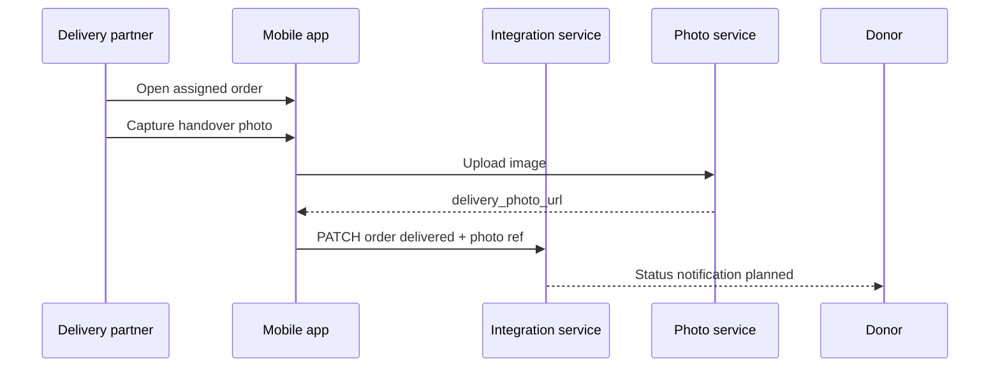
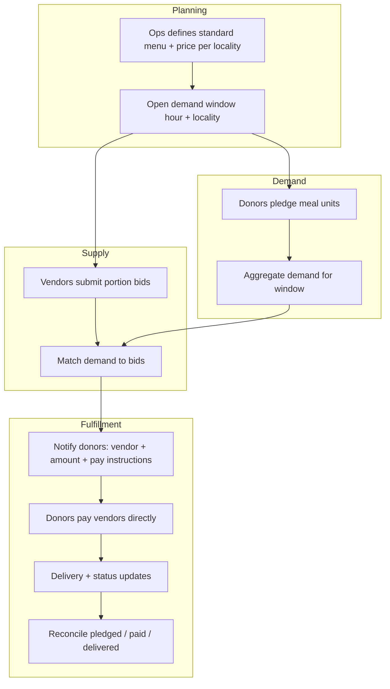

# SharingBridge — Future extensions (order operations & locality marketplace)

**Purpose:** Capture **sanitized, feasible** product extensions beyond today’s **order initiation** MVP (donor copies instructions → record registered). Use this doc for roadmap alignment and design reviews.

**Neighbourhood dashboard columns (June 2026):** authoritative spec in [PRODUCT_ROADMAP.md](../development/PRODUCT_ROADMAP.md) — **Order intent taken**, **Delivered at**, **Distance (m)**; sort by `distance_m` asc; donor neighbourhood photos.

**Related:** [SharingBridge_End_to_End_Workflow.md](./SharingBridge_End_to_End_Workflow.md) (BRD steps 8–12), [SharingBridge_Business_Requirement.md](../requirements/SharingBridge_Business_Requirement.md) (payments stay with vendors), [database.md](../configuration/database.md) (persistence target), [authentication.md](../configuration/authentication.md) (roles).

---

## What exists today (baseline)

| Capability | Status |
|------------|--------|
| Donor registers **order initiation** after copying delivery instructions | Shipped |
| Fields: pack id, notes, preset snapshot, `instructions_copied` status | Shipped |
| Donor lists **own** initiations (mobile); coordinator lists **all** (web) | Shipped |
| Geo on order intent (`location_lat/lng`, `locality_key`); donor neighbourhood feed; PostGIS `ST_DWithin` list queries | Shipped — [database.md](../configuration/database.md) |
| Payment / delivery lifecycle, coordinator **map** UI (bbox / clustering) | **Not shipped** |
| Delivery photo proof, delivery-partner role | **Planned** |
| Locality demand + vendor bidding marketplace | **Future extension** (this doc §4) |

Payments for food still happen in **vendor apps** (Swiggy, Zomato, etc.). SharingBridge tracks **intent and status**, not card charges, unless a later scope explicitly adds audited payment references.

---

## Design principles (all phases)

1. **Facilitator, not merchant of record** — Donors pay **vendors or delivery partners directly**; the platform orchestrates visibility, assignment, and status—not a pooled escrow account unless a future legal scope says otherwise (see BRD *Operating Constraints*).
2. **Server-side authorization** — Donors see only their rows; coordinators see operational fields; **admins** see PII (e.g. email) when needed. APIs on Render; Postgres on Supabase with **no client DB keys** ([authentication.md](../configuration/authentication.md)).
3. **Single persistence** — Postgres only after cutover; no parallel JSON file reads in production ([database.md](../configuration/database.md)).
4. **Explicit status enums** — Human-readable states donors and coordinators can understand and audit.

---

## Phase A — Order operations (near-term)

**Goal:** Turn **order initiation** into a trackable **order** for coordinators and donors, without vendor API integration.

### A.1 Donor marks payment done

After the donor places and pays in the **vendor app**, they open **order history** (mobile; web if donor sign-in is offered later), select the record, and set:

| Field | Example values |
|-------|------------------|
| `payment_status` | `pending` → `paid_externally` (donor action) |

- **Who can update:** Donor (own record only); coordinator/admin may correct in disputes (audit log later).
- **UX:** Single action — “Mark payment done” on the selected row; optional confirmation dialog.
- **No** automatic payment verification in this phase (no Swiggy/Zomato webhooks).

### A.2 Coordinator / donor dashboards (next slice)

**Goal:** Donors see **neighbourhood activity** (default window from `DONOR_NEIGHBOURHOOD_WINDOW_HOURS`) on mobile and web; coordinators retain full ops view. **Dashboard list columns** (planned — [PRODUCT_ROADMAP.md](../development/PRODUCT_ROADMAP.md)): **Order intent taken** (`created_at`), **Delivered at** (`delivered_at`, often empty), **Distance (m)** (`distance_m`); list sorted by **`distance_m` ascending** when viewer sends `near_lat` / `near_lng`; elapsed freshness from **`created_at`** only.

| Viewer | List | PII / photos |
|--------|------|----------------|
| **Donor** (mobile + web) | Own intents + **neighbourhood** feed (`since`, `near_lat`/`near_lng`); web groups **By day** / **By area** (area includes **No location on record**) | **No email**; opaque donor id; **reference thumbnails in neighbourhood feed** within the server time window |
| **Coordinator** | All intents; filter by day, `user_id`, optional `since`, `near_lat/lng`, `locality_key` (PostGIS; map UI later) | Full ops fields; **donor email**; photos per policy |
| **Admin** | Same as coordinator + user lookup | May include email for support |

Donor web uses the **limited** dashboard ([environment-variables.md](../configuration/environment-variables.md) § Web dashboard roles). **`since=Nh`** and **`near_lat` / `near_lng`** apply radius **`DONOR_NEIGHBOURHOOD_RADIUS_M`** (metres) server-side; API returns **`distance_m`** per row and **`feed.radius_m`**. Without viewer location, donors see only their own rows in the time window. Location is stored on `POST` when `location_lat` / `location_lng` are sent (mobile **Help a seeker** captures GPS on copy/register). Named locality labels (`chennai-adyar`) remain future work.

**Neighbourhood API:**

- `GET /v1/donor-seeker/order-intents?since=2h&near_lat=…&near_lng=…` — server applies radius; response rows include `distance_m`, `created_at`, `delivered_at` (when column exists).
- `GET /v1/donor-seeker/order-intents?locality_key=…&since=2h`

### A.3 Data fields (additive)

Extend stored order / order_intent records:

- `payment_status`, `delivery_status`
- `location_lat`, `location_lng`, `location_label`, `locality_key` (optional at registration; PostGIS `location` **shipped**)
- `delivered_at` (nullable; dashboard column before Phase B routinely fills it — [schema-delivered-at-migration.sql](../configuration/schema-delivered-at-migration.sql))
- `updated_at` for filters; list sort by **`distance_m`** when neighbourhood coords present (not `updated_at` for donor neighbourhood view)

JWT: keep active `role` per session; add `roles[]` and optional **`admin`** in `user_roles` ([database.md](../configuration/database.md)).

### A.4 API sketch (illustrative)

- `PATCH /v1/donor-seeker/order-intents/:id` — donor updates `payment_status` on own row.
- `GET /v1/donor-seeker/order-intents?since=2h&locality_key=…` — neighbourhood + coordinator filters (§ A.2).
- Integration-service: strip **email** from donor-role responses; omit or redact `reference_photo_*` URLs when intent age > 2h for donor JWT.
- Response grouping by day + `user_id` / locality: client-side today; server-side optional.

**Feasibility:** High. Builds on existing routes and auth; needs Postgres + UI work.

### A.5 Coordinator map UI (PostGIS list queries shipped)

**Shipped:** `order_intents.location` + `listForDashboard` SQL (`ST_DWithin`, `locality_key`). Run [schema-postgis-migration.sql](../configuration/schema-postgis-migration.sql) on older DBs; `npm run db:backfill-order-intent-geo` in integration-service.

**Next:** Coordinator web map (pins, bbox pan) using the same `near_lat` / `near_lng` / `since` params; optional `ST_MakeEnvelope` for viewport queries.

---

## Phase B — Delivery proof (next after A)

**Goal:** Close the loop in BRD steps 10–11 with evidence, without claiming legal certification.

### B.1 Delivery partner captures proof

1. Authorized **delivery partner** (new role or vendor-scoped account) opens an assigned order.
2. Takes a **photo at handover** to the seeker (in-app camera).
3. Upload goes to **photo-service** (or integration-stored object URL); linked on the same order record.
4. Sets `delivery_status` → `delivered` (or `completed`).

| Field | Notes |
|-------|--------|
| `delivery_photo_url` | Time-limited or access-controlled URL |
| `delivered_at` | Timestamp (nullable on intent row until partner marks delivery; shown on dashboard even when empty) |
| `delivery_status` | `out_for_delivery` → `delivered` |

### B.2 Donor visibility

Donor sees status progression and optionally a thumbnail of delivery proof (policy: blur faces if required by safety module later).

**Feasibility:** Medium. Depends on `sharingbridge-photo-service`, delivery-role auth, and mobile capture UX. Aligns with [Technical Architecture](./SharingBridge_Technical_Architecture.md) delivery verification themes.

---

## Phase C — Locality demand & vendor bidding (future marketplace)

**Status:** **Concept / extension** — sanitize for roadmap; **not** in current MVP scope. Competes in product spirit with “donor picks Swiggy preset” but serves **aggregated community demand** and **local vendor capacity**.

### C.1 Problem being solved

For a given **locality** and **time window** (e.g. next hour, lunch slot in Adyar):

- Many donors want to fund **standardized meals** (fixed menu, fixed price).
- Multiple **local vendors** can each commit to preparing/delivering **a portion** of that demand.
- The platform **aggregates demand**, runs a **bid/commitment** round, **allocates** orders to vendors, and **notifies donors** to pay **those vendors directly** for what they pledged.

SharingBridge **coordinates** visibility, matching, and status—it does **not** hold donor money in a platform pool in this design.

### C.2 Core concepts

| Concept | Description |
|---------|-------------|
| **Standard offer** | Fixed menu + fixed price per meal (defined per locality/campaign). |
| **Demand window** | Hour (or slot) + `locality_key` — e.g. “2026-05-28 12:00–13:00, chennai-adyar”. |
| **Demand signal** | Count or list of donor pledges/intent for that window (meal units). |
| **Vendor bid** | Vendor states how many portions they can prepare **and** deliver in that window, at what price/terms. |
| **Allocation** | Platform splits total demand across winning bids (rules TBD: pro-rata, priority, capacity caps). |
| **Donor payment** | Donor pays **assigned vendor** via vendor’s UPI/link/cash-on-delivery—recorded as `paid_to_vendor` in app. |
| **Reconciliation** | Track pledged vs committed vs paid vs delivered; coordinator dashboard for exceptions. |

### C.3 Dashboards (new surfaces)

| Dashboard | Audience | Purpose |
|-----------|----------|---------|
| **Demand board** | Coordinators, vendors | One side: meal demand for hour/locality; other side: vendor commitments |
| **Donor pledge** | Donors | Pledge N standard meals for a slot; later notified which vendor to pay |
| **Vendor bid** | Vendors | Enter capacity (portions) for upcoming window |
| **Reconciliation** | Coordinators, admin | Unpaid pledges, under-filled bids, delivery exceptions |

This is a **second** web experience alongside today’s “order initiation history” coordinator view—or a merged product with clear mode switch.

### C.4 High-level flow

### C.5 Feasibility assessment

| Area | Assessment |
|------|------------|
| **Product** | Feasible as a **separate module** after order operations (Phase A) and identity/roles are stable. |
| **Technical** | Needs new tables (`demand_windows`, `standard_offers`, `pledges`, `vendor_bids`, `allocations`), notification service, and vendor onboarding—not an extension of `order_intents` alone. |
| **Payments** | Feasible if **donor → vendor direct** only; reconciliation is **status + reference**, not card processing in-app. |
| **Legal / trust** | Pledges remain **non-binding intent** until payment (per BRD); vendor commitments need clear T&Cs outside this doc. |
| **Ops** | Requires coordinator runbook for failed bids, partial fill, and refunds **outside** the app. |

### C.6 Explicit non-goals (Phase C as described)

- Platform escrow or wallet holding donor funds.
- Automatic charge to donor card inside SharingBridge.
- Guaranteed fill of 100% demand (partial fulfillment must be designed).
- Replacing vendor apps for ad-hoc donor orders (Phase C is **parallel** to preset/deep-link flow).

### C.7 Suggested implementation order (if approved later)

1. Phase A — payment/delivery status + dashboards (donor mark paid).
2. Phase B — delivery photo + `delivered`.
3. Phase C.0 — data model + coordinator **read-only** demand board (manual vendor commitments).
4. Phase C.1 — vendor accounts + bidding API.
5. Phase C.2 — allocation engine + donor notifications.
6. Phase C.3 — reconciliation tooling.

---

## Summary table

| Phase | Donor | Coordinator | Vendor | Delivery |
|-------|-------|-------------|--------|----------|
| **Today** | Register initiation, own list | All initiations | External app only | External |
| **A** | Mark payment done on record | All orders, filters, grouping | — | Status fields only |
| **B** | See delivery proof | Monitor | — | Photo + complete |
| **C** | Pledge standard meals; pay assigned vendor | Demand/bid board, reconcile | Bid capacity | Assigned runs |

---

## Document maintenance

When Phase A ships, update:

- [SharingBridge_End_to_End_Workflow.md](./SharingBridge_End_to_End_Workflow.md) status table (steps 8–11).
- [database.md](../configuration/database.md) schema section.
- [MANUAL_TESTING_GUIDE.md](../testing/MANUAL_TESTING_GUIDE.md) new flows.
- [AGENT_HANDOFF.md](../development/AGENT_HANDOFF.md) “Next Recommended Tasks”.

**Last updated:** 2026-05-28 — initial roadmap capture from product discussion.
