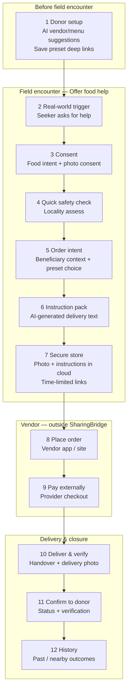
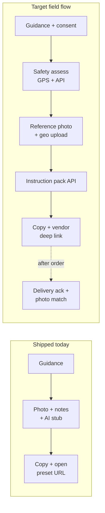
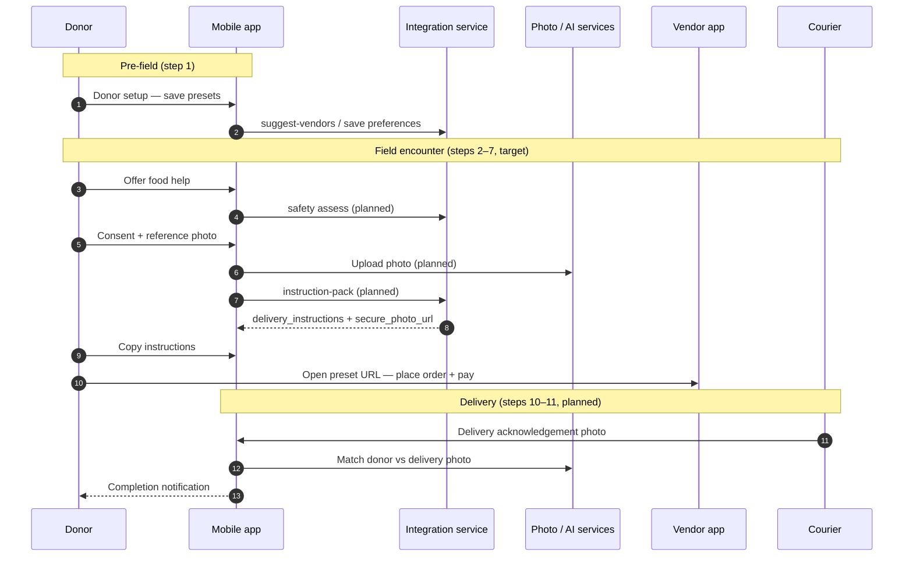
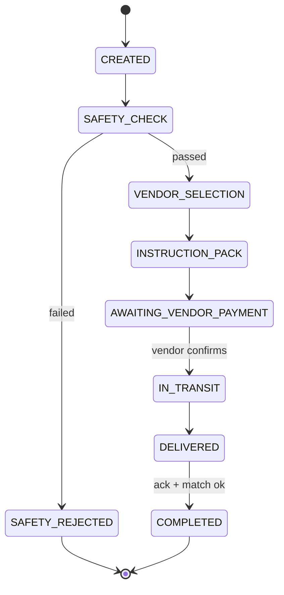

# SharingBridge — End-to-End Workflow (with diagrams)

**Purpose:** One place to see the **full product journey** from donor setup through delivery confirmation. Use this for onboarding, reviews, and alignment with implementation.

**Source of truth for step definitions:** [SharingBridge_Business_Requirement.md](../requirements/SharingBridge_Business_Requirement.md) → **Core Workflow** (steps 1–12).

---

## Which document covers what?

| Document | Best for | Pictorial? |
|----------|----------|------------|
| **[Business Requirement](../requirements/SharingBridge_Business_Requirement.md)** | Product steps 1–12, benefits, constraints | Text list only |
| **This doc** | End-to-end journey + **diagrams**; shipped vs planned | Yes (Mermaid) |
| **[Technical Architecture](SharingBridge_Technical_Architecture.md)** | Services, APIs, deep-link privacy, order states, safety/photo algorithms | Some ASCII blocks |
| **[Implementation Approach](../development/IMPLEMENTATION_APPROACH.md)** | Build phases, free tier, **AI interactions** slice (safety, instruction pack, match) | Tables; links here |
| **[Donor Setup AI Search Sequence](Donor_Setup_AI_Search_Sequence.md)** | Donor setup only (suggest → save presets) | Sequence diagram |
| **[Manual Testing Guide](../testing/MANUAL_TESTING_GUIDE.md)** | How to **verify** shipped slices on a device | Commands, not product flow |
| **[Agent Handoff](../development/AGENT_HANDOFF.md)** | What is **live in code today** and next tasks | Status bullets |

**Gap this doc fills:** The BRD defines *what* happens; the architecture defines *how* technically; the manual guide defines *how to test*. This file connects them with **visual flows** and marks **shipped / partial / planned**.

---

## Full product workflow (BRD steps 1–12)

---

## Implementation status (mobile + backend MVP)

Legend: ✅ shipped (partial or full) · 🟡 in progress / stub · ⬜ planned

| Step | Status | Where documented / built |
|------|--------|---------------------------|
| 1 Donor setup | ✅ | [Donor_Setup_AI_Search_Sequence](Donor_Setup_AI_Search_Sequence.md); `sharingbridge-mobile-app` donor_setup |
| 2 Trigger | ✅ (UX) | Home hub → **Offer food help** |
| 3 Consent | 🟡 | Guidance copy; full consent gates planned in AI interactions |
| 4 Safety | ⬜ | Architecture + [IMPLEMENTATION_APPROACH § AI interactions](../development/IMPLEMENTATION_APPROACH.md); not wired in app |
| 5 Order intent | 🟡 | Presets loaded; formal order intent service ⬜ |
| 6 Instruction pack | 🟡 | Local **stub**; API pack ⬜ |
| 7 Secure store | ⬜ | `sharingbridge-photo-service` planned |
| 8–9 Vendor order + pay | 🟡 | Copy + open preset URL; OAuth/deep-link builder ⬜ |
| 10 Deliver + photo | ⬜ | Delivery acknowledgement + match planned |
| 11 Donor confirm | ⬜ | `sharingbridge-notification-service` |
| 12 History | ⬜ | Web/mobile history views |

---

## Offer food help — current vs target (field slice)

**Today (3 mobile steps):** guidance → optional photo + verbal notes + instruction **stub** → copy + open saved vendor link.

**Target (6 stopovers):** per [IMPLEMENTATION_APPROACH — AI interactions](../development/IMPLEMENTATION_APPROACH.md) (section *AI interactions — donor–seeker field slice*).

---

## Actors and systems (sequence)

High-level message flow for the **external vendor** path (MVP manual copy-paste). Payment and fulfillment stay on the vendor platform.

---

## Order lifecycle (technical states)

From [Technical Architecture](SharingBridge_Technical_Architecture.md) — order-service state machine (simplified):

Exact state names may evolve in `sharingbridge-order-service`; treat this as the intended progression.

---

## Related diagrams

- **Donor setup only:** [Donor_Setup_AI_Search_Sequence.md](Donor_Setup_AI_Search_Sequence.md)
- **Deep link + secure beneficiary data:** Technical Architecture §3.5 and Strategy 2 (external vendors)
- **Per-repo build checklists:** [MVP_BOOTSTRAP_ISSUES.md](../development/MVP_BOOTSTRAP_ISSUES.md)

---

## Keeping this doc current

When shipping a BRD step or changing field-flow stopovers:

1. Update the **Implementation status** table above.
2. Adjust **Offer food help — current vs target** if mobile steps change.
3. Point **Agent Handoff** and **Manual Testing Guide** to this file for workflow context (they stay task-focused).
