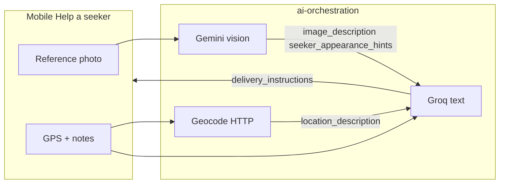

# AI implementation plan

**Status:** Active plan (June 2026)  
**Audience:** Engineering and product  
**Related:** [AI_PLATFORM_INTEGRATION.md](./AI_PLATFORM_INTEGRATION.md) (hosting, env, bridges), [Donor_Setup_AI_Search_Sequence.md](../design/Donor_Setup_AI_Search_Sequence.md), [field-handoff.md](../configuration/field-handoff.md)

This document is the **full phased plan** for SharingBridge AI: preset collection, image/location descriptions, and seeker identification. It also answers **LangChain vs direct LLM** for this codebase.

---

## What is shipped today

| Piece | State |
|-------|--------|
| `sharingbridge-ai-orchestration` | FastAPI service; **`AI_LLM_MODE=deterministic`** (no live model) |
| Integration flags | `AI_SUGGEST_VENDORS_ENABLED`, `AI_INSTRUCTION_PACK_ENABLED` + `AI_ORCHESTRATION_BASE_URL` |
| Mobile **Vendor presets** | `POST /v1/donor-setup/suggest-vendors` → orchestration or mock fallback |
| Mobile **Help a seeker** | Photo upload → `POST /v1/donor-seeker/instruction-pack`; **GPS captured before instruction-pack** (not only on copy) |
| `sharingbridge-photo-service` | Reference photo upload + JWT; **no vision/embeddings yet** |
| Live LLM (Gemini + Groq) | **Wired** when `AI_LLM_MODE=live` + API keys; falls back to deterministic on error |

---

## Provider split (locked)

Two **free-tier** providers, one role each. Both called only from `sharingbridge-ai-orchestration` via **direct HTTP/SDK** (no LangChain). Mobile and integration-service see a single orchestration base URL.

| Provider | Role | Endpoints / steps | Models (staging defaults) |
|----------|------|-------------------|---------------------------|
| **Google Gemini** | **Vision** — reference photo at order-intent / instruction time | `image_description`, soft **seeker identification** (appearance only, no name claims) | `gemini-2.0-flash` or `gemini-2.5-flash` (multimodal) |
| **Groq** | **Text** — presets + instruction composition | `suggest-vendors` JSON; `delivery_instructions` + `seeker_handover_hints` using Gemini outputs + geocode + donor notes | `llama-3.3-70b-versatile` |

**Why split**

- Gemini free tier supports **image + text** (required for seeker reference photo).
- Groq free tier is **fast text-only** — good for structured preset JSON and long instruction merge.
- Groq never receives raw image bytes; only Gemini’s **text** outputs (`image_description`, `seeker_appearance_hints`).

**Fallback:** `AI_LLM_MODE=deterministic` (CI + offline); integration mock fallback if orchestration fails.



---

## Three product goals

### 1) AI for collecting presets (donor setup)

**User story:** Donor types free text (app, restaurant, menu hints); app uses location when available; API returns up to five confirmable presets with deep links.

**Flow:** Mobile → `POST /v1/donor-setup/suggest-vendors` → integration → `POST /internal/v1/llm/suggest-vendors` → donor confirms → `POST /v1/donor-setup/preferences`.

**Outputs (strict JSON):**

```json
{
  "suggestions": [
    {
      "restaurant_name": "string",
      "app_name": "string",
      "menu_items": ["string"],
      "order_url": "https://...",
      "confidence": 0.0
    }
  ]
}
```

**Acceptance:** Suggestions respect `query_text` + optional `lat`/`lng`/`manual_area`; invalid JSON → integration mock fallback; no client-side API keys.

---

### 2) Image description and location description (Help a seeker)

**User story:** When the donor generates delivery instructions, the courier text includes human-readable **where** and **who to look for** (appearance only), not only raw coordinates.

| Field | How produced | Stored |
|-------|----------------|--------|
| **`location_description`** | Reverse geocode (Nominatim or Maps API) + optional one-line LLM polish from `lat`/`lng`/`location_label` | Order intent `payload` and/or columns |
| **`image_description`** | **Gemini** vision on reference thumbnail URL (consent-based photo) | Order intent `payload` |
| **`seeker_appearance_hints`** | **Gemini** — soft identification from photo (clothing, context; no legal ID) | Same |
| **`location_description`** | Reverse geocode + optional **Groq** one-line polish | Same |
| **`delivery_instructions`** | **Groq** — merges presets, notes, Gemini text fields, location, program copy | Mobile + clipboard |
| **`seeker_handover_hints`** | **Groq** — courier-facing block built from Gemini + notes | Same |

**Inputs already available:** `lat`/`lng` from mobile at instruction generation, `reference_photo_artifact_id`, `verbal_handover_notes`, saved presets.

**Policy:** No named identification claims from vision (“this is Raj”); no medical/legal assertions; run existing `sanitize_handover_notes` on all generated text.

---

### 3) Locating and identifying the seeker

Split into two layers — different technology and privacy review.

**A — Soft identification (Gemini + Groq, Phase 2–4)**  
**Gemini** extracts `image_description` and `seeker_appearance_hints` from the reference photo. **Groq** composes **`seeker_handover_hints`** and the final `delivery_instructions` from those strings plus `location_description` and donor notes. Non-definitive, consent-based wording only.

**B — Hard identification (CV, Phase 5)**  
- On `seeker_reference` upload: face embedding in **photo-service** (not LLM).  
- On delivery acknowledgement photo: similarity score vs reference.  
- Internal route e.g. `POST /internal/v1/cv/seeker-match`.  
- Requires explicit privacy review before production.

---

## LangChain vs direct LLM — recommendation

### Short answer

**Use direct LLM calls (OpenAI SDK or equivalent) with explicit Python pipeline steps.**  
Do **not** introduce LangChain for the MVP live model path. Revisit LangChain (or LangSmith-only tracing) when flows become multi-tool, retrieval-heavy, or branchy.

### Why direct LLM fits SharingBridge now

| Factor | This project | Implication |
|--------|----------------|-------------|
| Number of flows | 2 main LLM surfaces (suggest-vendors, instruction-pack) + 1–2 sub-steps (geocode, vision) | Linear pipelines, not agents |
| Output shape | Fixed JSON / fixed narrative sections | `response_format` / Pydantic validation is enough |
| Latency & cost | Mobile user waiting on one button | Fewer hops = fewer tokens and failures |
| Existing code | Deterministic builders in `app/services/*.py` | Swap “deterministic” for “call OpenAI” behind `AI_LLM_MODE` |
| CI | Must not require live API keys | Mock LLM client in tests; deterministic mode stays default |

### What LangChain is good for (later)

- **RAG** over donor history, vendor catalogs, or policy docs  
- **Multi-tool agents** (search web, call maps, call DB, then summarize)  
- **Complex retry / branch graphs** with LangSmith evals in staging  
- **Many prompt versions** with shared memory/chains across 5+ endpoints  

None of these are required for the first live LLM release.

### Recommended orchestration pattern (no LangChain)

Treat each endpoint as a **plain async pipeline** in `sharingbridge-ai-orchestration`:

```text
instruction_pack(payload):
  1. sanitize_notes(payload)                    # rules, no LLM
  2. location_description = geocode(lat, lng)   # HTTP (Nominatim / Maps)
  3. if reference_photo:
       gemini_vision(photo_url) → image_description, seeker_appearance_hints
  4. groq_compose_instruction_pack(
       presets, notes, location_description,
       image_description, seeker_appearance_hints
     ) → delivery_instructions, seeker_handover_hints
  5. validate(InstructionPackResponse)
  6. return JSON (fields persisted on order intent POST)
```

```text
suggest_vendors(payload):
  1. build_prompt(query, location context)
  2. groq_structured_json(SuggestVendorsResponse)
  3. enrich_urls / clamp to 5
  4. return JSON
```

**Optional:** LangSmith (or OpenTelemetry) for trace IDs **without** LangChain abstractions.

### What not to put in LangChain

- Face embedding and donor↔delivery match (**photo-service**, CV model)  
- PostGIS neighbourhood queries (**integration-service**)  
- JWT auth and photo upload (**integration / photo-service**)

---

## Implementation phases

| Phase | ID | Deliverable | LLM? | Repo(s) |
|-------|-----|-------------|------|---------|
| **0** | — | Deterministic orchestration + integration flags + mobile HTTP | No | Done |
| **1** | AI-1 | Live **suggest-vendors** via **Groq** | Groq ×1 | ai-orchestration |
| **2** | AI-2 | **location_description** (geocode + optional Groq polish) | Groq ×0–1 | ai-orchestration |
| **3** | AI-3 | **Gemini vision** → `image_description`, `seeker_appearance_hints` | Gemini ×1 | ai-orchestration, photo-service |
| **4** | AI-4 | **Groq** compose `delivery_instructions` + `seeker_handover_hints` | Groq ×1 | ai-orchestration |
| **5** | AI-5 | Persist Gemini/Groq fields on order intent; web detail | No | integration, web-app |
| **6** | AI-6 | Face embedding + delivery match | CV | photo-service |

### Phase AI-1 — Presets (Groq)

**Code:**

- `app/llm/groq_client.py` — OpenAI-compatible client, `base_url=https://api.groq.com/openai/v1`  
- `app/services/suggest_vendors.py` — branch on `AI_LLM_MODE=live`  
- `prompts/suggest_vendors_v1.yaml`  
- Tests: mock Groq; CI keeps `deterministic`  

**Deploy:**

- Render: `GROQ_API_KEY`, `GROQ_MODEL=llama-3.3-70b-versatile`, `AI_LLM_MODE=live`  
- Integration: `AI_SUGGEST_VENDORS_ENABLED=true`  

**Done when:** Donor setup search returns Groq-ranked vendors in staging.

---

### Phase AI-2 — Location description

**Code:**

- `app/geo/reverse_geocode.py` — Nominatim (dev) or Google Geocoding (prod)  
- Optional Groq one-line polish of geocode result  
- Add `location_description` to `InstructionPackResponse` schema  

**Done when:** Instruction text includes a readable place line, not only raw coordinates.

---

### Phase AI-3 — Image + seeker appearance (Gemini)

**Code:**

- `app/llm/gemini_client.py` — multimodal generate (photo URL or bytes)  
- `prompts/seeker_vision_v1.yaml` — appearance-only; no names/IDs  
- Internal signed URL from photo-service  
- Response fields: `image_description`, `seeker_appearance_hints`  

**Deploy:** `GEMINI_API_KEY`, `GEMINI_VISION_MODEL=gemini-2.0-flash`  

**Done when:** Reference photo yields stored text fields on order intent registration.

---

### Phase AI-4 — Instruction compose (Groq)

**Code:**

- `groq_compose_instruction_pack()` — **inputs are text only** (includes Gemini outputs)  
- `prompts/instruction_pack_v1.yaml`  
- Output: `delivery_instructions`, `seeker_handover_hints`  

**Done when:** Courier clipboard text references Gemini image/seeker hints and geocoded location.

---

### Phase AI-5 — Persist and surface

**Code:**

- Store `image_description`, `seeker_appearance_hints`, `location_description`, `seeker_handover_hints` on order intent  
- Web donor/coordinator detail panel  

**Done when:** Dashboard detail matches generated instructions.

---

### Phase AI-6 — Hard match (later)

See [SharingBridge_Technical_Architecture.md](../design/SharingBridge_Technical_Architecture.md) §3.3 and photo-service roadmap. **Not** part of first LLM launch.

---

## Environment checklist

### ai-orchestration

| Variable | Purpose |
|----------|---------|
| `AI_LLM_MODE` | `deterministic` (CI/default) or `live` |
| `GROQ_API_KEY` | [Groq console](https://console.groq.com/) — presets + instruction compose |
| `GROQ_MODEL` | e.g. `llama-3.3-70b-versatile` |
| `GROQ_BASE_URL` | default `https://api.groq.com/openai/v1` |
| `GEMINI_API_KEY` | [Google AI Studio](https://aistudio.google.com/app/apikey) — vision only |
| `GEMINI_VISION_MODEL` | e.g. `gemini-2.0-flash` |
| `AI_ORCHESTRATION_INTERNAL_API_KEY` | Service-to-service auth |
| `PHOTO_SERVICE_BASE_URL` | Signed photo URL for Gemini (AI-3+) |
| `GEOCODING_*` | Phase AI-2 (Nominatim or Maps) |
| `SHARINGBRIDGE_WEBSITE_URL` | Instruction-pack intro line |

Legacy (optional): `OPENAI_API_KEY` — not used in the Gemini+Groq split; remove from Render when migrating.

### integration-service

| Variable | Purpose |
|----------|---------|
| `AI_ORCHESTRATION_BASE_URL` | e.g. `https://sharingbridge-ai-orchestration.onrender.com` |
| `AI_SUGGEST_VENDORS_ENABLED` | `true` after AI-1 |
| `AI_INSTRUCTION_PACK_ENABLED` | `true` after AI-2+ |

---

## Testing strategy

| Layer | Approach |
|-------|----------|
| Unit | Mock LLM client; deterministic mode default |
| Integration | integration-service → mock orchestration HTTP (existing pattern) |
| Staging smoke | `AI_LLM_SMOKE_ENABLED=1` nightly optional; never in PR CI |
| Manual | [MANUAL_TESTING_GUIDE.md](../testing/MANUAL_TESTING_GUIDE.md) — extend after AI-1 |

---

## Decision log

| Date | Decision |
|------|----------|
| 2026-06 | **Direct OpenAI SDK pipelines** for MVP live LLM; LangChain deferred until RAG/agents needed |
| 2026-06 | GPS at **instruction generation** on mobile (committed `sharingbridge-mobile-app` `1f7f646`) |
| 2026-06 | Face match remains **photo-service** CV, not LLM |
| 2026-06 | **Gemini** = vision + seeker appearance; **Groq** = presets + instruction compose (free-tier split) |

---

## Document map

| Document | Role |
|----------|------|
| **This file** | Full AI phases, schemas, LangChain decision |
| [AI_PLATFORM_INTEGRATION.md](./AI_PLATFORM_INTEGRATION.md) | Service topology, sequences, env hosting |
| [ai-orchestration-local.md](../configuration/ai-orchestration-local.md) | Local three-service stack |
| [AGENT_HANDOFF.md](./AGENT_HANDOFF.md) | Shipped vs next tasks |
