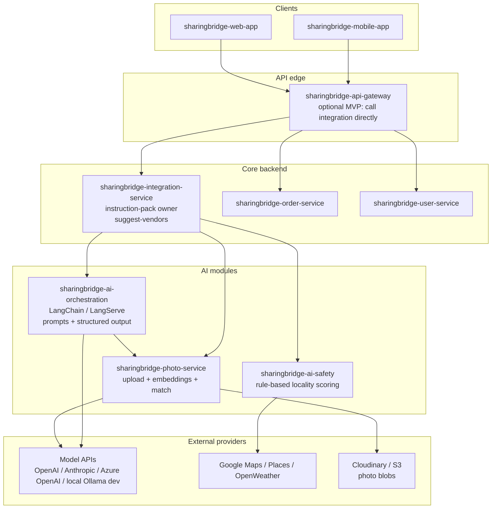
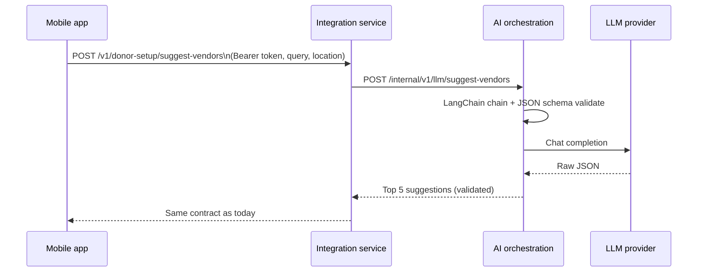
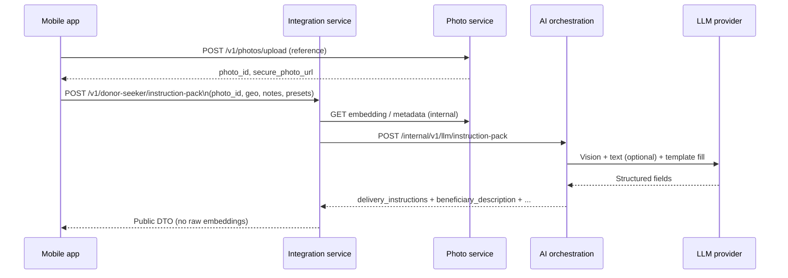

# AI Platform Integration — Technical Plan

**Status:** Planning (not implemented in application code yet)  
**Related:** [IMPLEMENTATION_APPROACH.md](./IMPLEMENTATION_APPROACH.md) (AI interactions slice), [SharingBridge_End_to_End_Workflow.md](../design/SharingBridge_End_to_End_Workflow.md), [Technical Architecture](../design/SharingBridge_Technical_Architecture.md) (Hybrid AI Strategy)

---

## Short answer: is AI implemented in the app today?

**No.** Real AI/ML pipelines are **not** wired end-to-end. What exists:

| Capability | Shipped in code? | Where |
|------------|-----------------|--------|
| Donor setup vendor suggestions | **Mock only** | `sharingbridge-integration-service` → `suggestVendors.js` (fixed JSON, no LLM) |
| Delivery instruction pack | **Mobile stub only** | `requestStubDeliveryInstructions` + `buildDeliveryInstructionsStub` |
| Locality safety scoring | **Not built** | Planned → `sharingbridge-ai-safety` (README only) |
| Photo upload, face embeddings, match | **Not built** | Planned → `sharingbridge-photo-service` (README only) |
| LLM orchestration (LangChain or equivalent) | **Not documented or built** | This document |

Mobile and backend **must not** call OpenAI/Anthropic (or similar) directly from the client. All model access goes through **backend AI modules** behind authenticated APIs.

---

## What the docs already say (and what is missing)

| Topic | Covered in existing docs? |
|-------|---------------------------|
| *That* AI should generate instructions / descriptions | Yes — BRD step 6, Technical Architecture “Hybrid AI Strategy” |
| Rule-based **safety** (maps, daylight, places) | Yes — IMPLEMENTATION_APPROACH Week 7, ai-safety bootstrap §8 |
| **Photo** storage + embeddings + match | Yes — photo-service bootstrap §9, architecture §3.3 |
| **LangChain** (or similar) setup on a host | **No** — until this doc |
| Prompt chains, structured JSON, retries, fallbacks | Partially — Donor Setup sequence assumes external AI; no runtime |
| Bridging **mobile → integration → AI platform → model APIs** | **No** — until this doc |
| Secrets, env, cost guards, observability for AI calls | Partially — generic Render/env notes only |

---

## Target architecture (bridge pattern)

Clients talk only to **SharingBridge backend APIs**. The **AI orchestration layer** (LangChain recommended for MVP) runs as a deployable service and calls **model providers** and **specialist services** (photo, safety).



**MVP simplification:** Collapse gateway until needed; **integration-service** HTTP-calls **ai-orchestration** on the same Render/Railway account or as a second service. Do **not** embed LangChain inside the Flutter app.

---

## AI capabilities → services → orchestration

| Product capability | Owning API (donor-facing) | AI module | Model / technique |
|--------------------|---------------------------|-----------|------------------|
| Donor setup: vendor/menu suggestions | `POST /v1/donor-setup/suggest-vendors` (integration) | Orchestration chain | LLM + strict JSON schema; location in prompt |
| Instruction pack + dignity filter | `POST /v1/donor-seeker/instruction-pack` (integration) | Orchestration chain | LLM + template merge; optional vision on reference photo |
| Beneficiary verbal notes sanitization | Same | Orchestration sub-chain | LLM policy pass |
| Locality safety | `POST /v1/safety/assess` (ai-safety) | **No LLM required** for MVP | Rule-based + Maps/Places APIs |
| Reference photo storage | `POST /v1/photos/upload` (photo-service) | Storage pipeline | S3/Cloudinary |
| Face embedding + donor↔delivery match | photo-service + order events | CV pipeline | Embedding model (e.g. FaceNet-class); not necessarily LLM |
| Assistance history hint (optional) | order / photo-service | Embedding similarity | Architecture §3.3 |

**LangChain role:** Orchestrate **LLM** flows only (suggest-vendors, instruction-pack, text sanitization). Use **dedicated services** for safety rules and computer vision—not every path needs LangChain.

---

## Proposed repo: `sharingbridge-ai-orchestration`

New service (skeleton today: **does not exist**; add to org alongside ai-safety and photo-service).

**Responsibilities:**

- Versioned **prompt templates** and **output JSON schemas**
- LangChain (or equivalent) chains: retrieve context → call LLM → validate → retry/fallback
- **No** donor auth logic (trust `integration-service` service-to-service token or internal network)
- Expose **internal** HTTP only (not public internet without gateway)

**Suggested endpoints (internal):**

```
POST /internal/v1/llm/suggest-vendors
POST /internal/v1/llm/instruction-pack
POST /internal/v1/llm/sanitize-text
GET  /health
```

Integration-service maps public routes to these internal calls and attaches `user_id`, request-id, and audit metadata.

---

## Hosting the AI modules (platform setup)

Align with [IMPLEMENTATION_APPROACH.md](./IMPLEMENTATION_APPROACH.md) free tier (Render/Railway) for MVP; model keys in dashboard env vars (secrets manager deferred).

### Option A — Recommended MVP

| Deployable | Host | Notes |
|------------|------|--------|
| `sharingbridge-ai-orchestration` | Render / Railway web service | Python (FastAPI) + LangChain; `PORT`, health check |
| `sharingbridge-ai-safety` | Same or separate service | Node or Python; maps API keys |
| `sharingbridge-photo-service` | Same or separate service | Upload + embedding worker |
| Model APIs | Vendor cloud | OpenAI / Anthropic / Azure OpenAI |
| LangSmith (optional) | LangChain SaaS | Tracing, evals — dev/staging |

### Option B — LangServe on managed host

Package orchestration as **LangServe** app (FastAPI) deployed like any other backend service. Integration-service calls `https://ai-orchestration-<env>.onrender.com/...`.

### Option C — Local dev

- **Ollama** or **LM Studio** for offline LLM via LangChain `ChatOllama` base URL
- `AI_LLM_BASE_URL=http://localhost:11434` in orchestration `.env`
- Mobile still uses integration-service on `localhost:8080` — never Ollama directly

### Environment variables (orchestration service)

```bash
# Model provider (pick one for MVP)
OPENAI_API_KEY=
# or ANTHROPIC_API_KEY= / AZURE_OPENAI_ENDPOINT= + AZURE_OPENAI_KEY=

AI_LLM_MODEL=gpt-4o-mini          # cost-conscious default
AI_LLM_TIMEOUT_MS=30000
AI_LLM_MAX_RETRIES=2

# Internal service URLs (called by orchestration)
PHOTO_SERVICE_BASE_URL=http://localhost:8092
AI_SAFETY_BASE_URL=http://localhost:8093

# Optional
LANGCHAIN_TRACING_V2=true
LANGCHAIN_API_KEY=                  # LangSmith
LANGCHAIN_PROJECT=sharingbridge-dev
```

Integration-service additionally needs:

```bash
AI_ORCHESTRATION_BASE_URL=http://localhost:8091
AI_ORCHESTRATION_INTERNAL_TOKEN=   # shared secret service-to-service
```

---

## Bridge: mobile ↔ backend ↔ AI (sequence)

**Donor setup — suggest vendors (target):**



**Offer food help — instruction pack (target):**



---

## LangChain implementation sketch (orchestration)

**Dependencies (Python example):**

- `langchain`, `langchain-openai` (or `langchain-anthropic`)
- `pydantic` for response models
- `fastapi`, `uvicorn`

**Patterns:**

1. **Structured output** — `with_structured_output(SuggestVendorsResponse)` or JSON mode + validator; reject malformed responses → integration returns safe fallback (manual entry message).
2. **Prompt registry** — `prompts/suggest_vendors_v1.yaml`, `prompts/instruction_pack_v1.yaml` in repo.
3. **Retries** — transient LLM errors only; no retry on 4xx validation failures.
4. **PII** — strip or minimize seeker identifiers in logs; use LangSmith only in non-prod or with redaction.

**Not in LangChain:**

- Safety score (call ai-safety HTTP from integration before starting instruction chain).
- Face match (photo-service after delivery upload).

---

## Phased rollout

| Phase | Deliverable | Replaces |
|-------|-------------|----------|
| **0** (today) | Mocks/stubs | — |
| **1** | Deploy `ai-orchestration` skeleton + health; wire integration `suggest-vendors` to LLM behind feature flag | `MOCK_SUGGESTIONS` |
| **2** | `instruction-pack` public API + mobile HTTP client | `requestStubDeliveryInstructions` |
| **3** | Deploy ai-safety + photo-service; wire safety gate + upload | Local-only photo path |
| **4** | Vision in instruction chain; delivery match job | Placeholder faceprint lines |

Feature flag example: `AI_SUGGEST_VENDORS_ENABLED=true` in integration-service env.

---

## Contracts and testing

- Publish OpenAPI for **public** integration routes first (`design/contracts/`).
- Internal orchestration contracts can live in `sharingbridge-ai-orchestration/openapi/` until gateway stabilizes.
- Contract tests: integration-service → mock orchestration HTTP server (no live LLM in CI).
- Optional nightly job: live LLM smoke with `AI_LLM_SMOKE_ENABLED=1`.

---

## Security and compliance

- API keys only on server-side orchestration and specialist services.
- Mobile receives **generated text** and **opaque photo URLs**, not provider keys or embeddings.
- Align instruction-pack wording with privacy review ([IMPLEMENTATION_APPROACH](./IMPLEMENTATION_APPROACH.md) privacy checkpoints).
- Log retention policy for LangSmith / application logs before production.

---

## Checklist: bootstrap AI platform (engineering)

- [ ] Create `sharingbridge-ai-orchestration` repo (FastAPI + LangChain + Dockerfile)
- [ ] Deploy to Render/Railway; set model API keys in dashboard
- [ ] Add `AI_ORCHESTRATION_BASE_URL` to integration-service
- [ ] Implement internal client in integration-service with timeout + typed errors
- [ ] Replace `buildSuggestVendorsResponse` mock path behind feature flag
- [ ] Implement `POST /v1/donor-seeker/instruction-pack` calling orchestration
- [ ] Update mobile: HTTP client for instruction-pack (remove stub default in prod builds)
- [ ] Deploy ai-safety and photo-service; wire IMPLEMENTATION_APPROACH phases A–D
- [ ] Add LangSmith project for dev tracing (optional)
- [ ] Document smoke steps in `testing/MANUAL_TESTING_GUIDE.md` when phase 1 ships

See [MVP_BOOTSTRAP_ISSUES.md](./MVP_BOOTSTRAP_ISSUES.md) §10 for copy-ready issue text.

---

## Document map (AI-related)

| Document | Use |
|----------|-----|
| **This file** | AI hosting, LangChain, bridges, env, phases |
| [IMPLEMENTATION_APPROACH.md](./IMPLEMENTATION_APPROACH.md) | Product-facing AI interactions (4 capabilities) |
| [Donor_Setup_AI_Search_Sequence.md](../design/Donor_Setup_AI_Search_Sequence.md) | Donor setup sequence (update when orchestration ships) |
| [SharingBridge_End_to_End_Workflow.md](../design/SharingBridge_End_to_End_Workflow.md) | Full journey diagrams |
| [MVP_BOOTSTRAP_ISSUES.md](./MVP_BOOTSTRAP_ISSUES.md) | Per-repo checklists |
